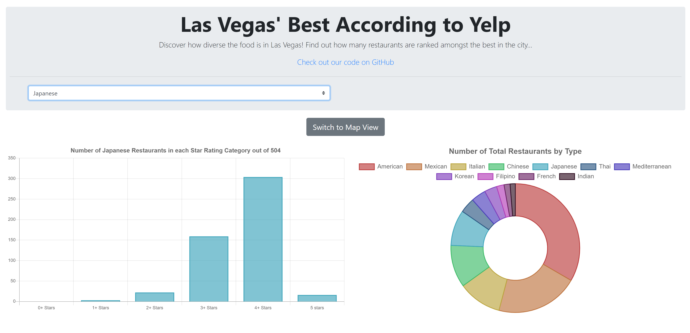
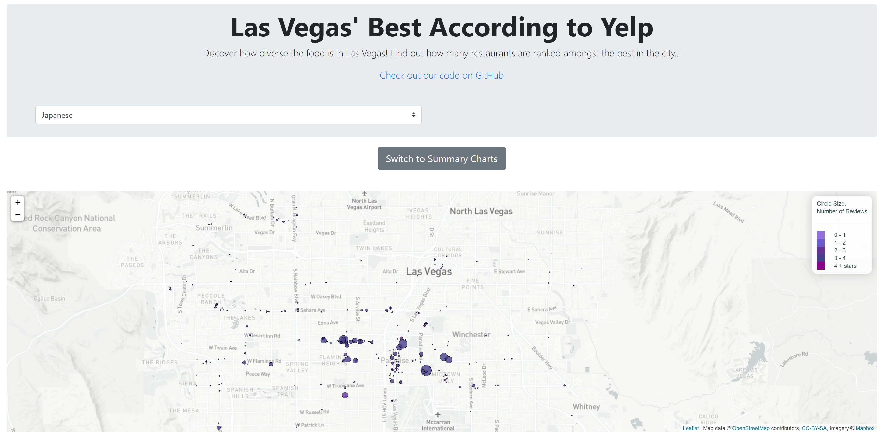

# Yelp Visualization Project

## Topic: 
Building an interface that allows users to see the restaurants of their choosing, by type of food, using Yelp API, Bootstrap, HTML, CSS, JS, Chart.js library, MongoDB, Python-Flask, Leaflet, and Mapbox.

## Articulation :pizza: vs. :taco:

We remembered the original question posed to us at the beginning of this bootcamp and thought to expand on it. Are Italian or Mexican restaurants more popular in the U.S.? We came up with using the Yelp dataset to create a more analytic version of Yelp’s GUI that limits what is shown to Las Vegas, Nevada. We chose Las Vegas since the Yelp Data only has a few clusters of cities available in the US and we thought what better than a city known for lots of tourism.

Ultimately, we used ETL procedures to take the Yelp Data and push it into our local MongoDB database. Afterwards, we used Python Flask to load the data from MongoDB to a locally hosted server on a "/data" endpoint in a JSON format. Once this was accomplished, we were able to create a few visualizations. 

The first visualization we created was a map that has circle markers. The circle markers size is based on the number of reviews and color is based on the number of stars. Clicking on the markers will reveal more information about the restaurant.

A static doughnut chart also appears that has the total number of each type of restaurant so the user is able to see the diversity between types. The doughnut chart is interactive in that if a label on the legend is clicked, it can be enabled/disabled.

Lastly, a bar chart is updated, showing the number of restaurants in each star rating category per food type. The bar chart updates depending on the food type chosen and the color matches what is on the doughnut chart for more clarity. The title also updated with the type of restaurant and the total number of restaurants in that category. This chart is also interactive in that hovering over the bar gives you the number of restaurants with that star rating.

## Shortcomings:

Originally we were going to allow the user to choose any city in the U.S. and see the top 10 restaurants by food type of their choosing. This would be useful for frequent travelers who are not familiar with the new city and might be looking for a hot spot to try out. The issue we ran into was that the Yelp Data only provides a few cities in the U.S. in the publicly available dataset. Another issue we ran into was that there were almost 40,000 restaurants even in the few cities available to search through. This would create load time issues when we tried to render visualizations due to the code traversing through a vast amount of data. We limited it just the state of Nevada and most of the restaurants in the data were around Las Vegas. We limited the search further by adding a limit in the Python-Flask code as this is for demonstration purposes and we are using local servers created on our computers. It's more effective to demonstrate a well executed interactive page than one that takes a couple minutes to load everytime a new food type is chosen.

### Team Members: 
* [Drew Gilmore](https://github.com/drewpgilmore)
* [Sagar Patel](https://github.com/Autonomousse)
* [Tony Min Sang Yoo](https://github.com/hialstkd)
* [Minerva Banuelos](https://github.com/minerva-b)

### Sources:
* [Yelp Data](https://www.yelp.com/dataset/)
* [Documentation (with screenshots)](https://www.yelp.com/dataset/documentation/main)
* [Mapbox](https://www.mapbox.com/)
* [MongoDB](https://www.mongodb.com/)
* [Chart.js](https://www.chartjs.org/)
* [Leaflet](https://leafletjs.com/)
* [Bootstrap](https://getbootstrap.com/)

## Screenshots:

